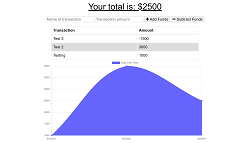

# Online/Offline Budget Tracker

## Description
The task is to add functionality to an existing Budget Tracker application to allow for offline access and functionality. The user will be able to add expenses and deposits to their budget with or without a connection. When entering transactions offline, they should populate the total when brought back online. When Offline Functionality is , Enter deposits offline, Enter expenses offline then when brought back online, Offline entries should be added to tracker.

 

## User Story

AS AN avid traveller
I WANT to be able to track my withdrawals and deposits with or without a data/internet connection
SO THAT my account balance is accurate when I am traveling

 

## Business Context

Giving users a fast and easy way to track their money is important, but allowing them to access that information anytime is even more important. Having offline functionality is paramount to our applications success.

 

## Acceptance Criteria

GIVEN a user is on Budget App without an internet connection
WHEN the user inputs a withdrawal or deposit
THEN that will be shown on the page, and added to their transaction history when their connection is back online.

 

## Table

- [Installation](#installation)
- [Screenshot](#screenshot)
- [Website](#website)
- [Credits](#credits)
- [License](#license)

## Installation
Once pulled over from gitHub onto your local machine.
- First is to open up Microsoft Visual Studio Code.
    
- Then over on the side bar click ad folder to workspace
    
- Once you see on the files, to view in browser, right click index.html under workspace and then click Reveal in file explorer.
    
- Once the window comes up with the file. Just double click the file and the file will open up in the browser of your choice. 

## Screenshot/video link

   

## Credits
https://bootcamp.unh.edu/ 
  
https://coding-boot-camp.github.io/full-stack/github/professional-readme-guide
  
https://choosealicense.com/

http://www.heroku.com/

https://www.mongodb.com/

## Deployment
https://morning-beyond-89786.herokuapp.com/
    
## Repository
https://github.com/coreyNance/workout_tracker

## License

MIT License

Copyright (c)  2021  Corey Nance

Permission is hereby granted, free of charge, to any person obtaining a copy
of this software and associated documentation files (the "Software"), to deal
in the Software without restriction, including without limitation the rights
to use, copy, modify, merge, publish, distribute, sublicense, and/or sell
copies of the Software, and to permit persons to whom the Software is
furnished to do so, subject to the following conditions:

The above copyright notice and this permission notice shall be included in all
copies or substantial portions of the Software.

THE SOFTWARE IS PROVIDED "AS IS", WITHOUT WARRANTY OF ANY KIND, EXPRESS OR
IMPLIED, INCLUDING BUT NOT LIMITED TO THE WARRANTIES OF MERCHANTABILITY,
FITNESS FOR A PARTICULAR PURPOSE AND NONINFRINGEMENT. IN NO EVENT SHALL THE
AUTHORS OR COPYRIGHT HOLDERS BE LIABLE FOR ANY CLAIM, DAMAGES OR OTHER
LIABILITY, WHETHER IN AN ACTION OF CONTRACT, TORT OR OTHERWISE, ARISING FROM,
OUT OF OR IN CONNECTION WITH THE SOFTWARE OR THE USE OR OTHER DEALINGS IN THE
SOFTWARE.

## Submission on BCS

* You are required to submit the following:

  * the URL to the deployed application

  * the URL to the Github repository

- - -
